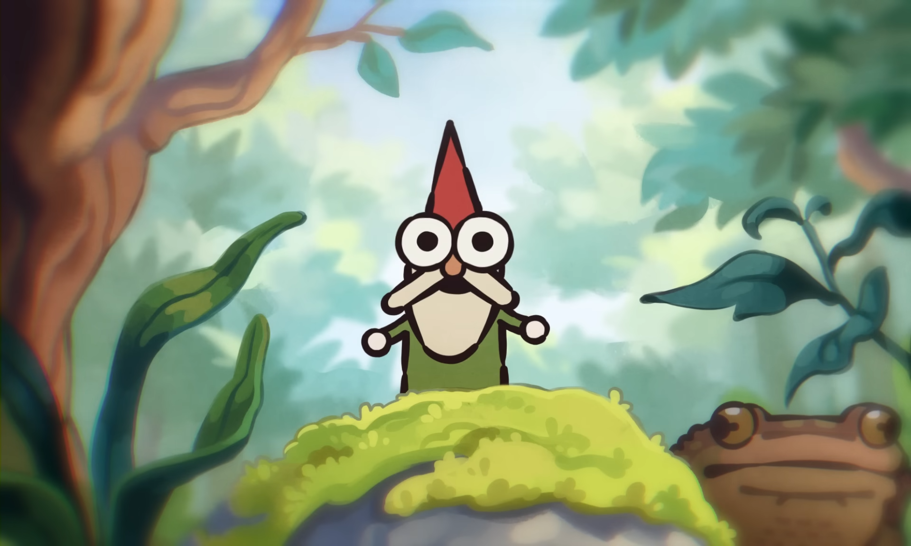
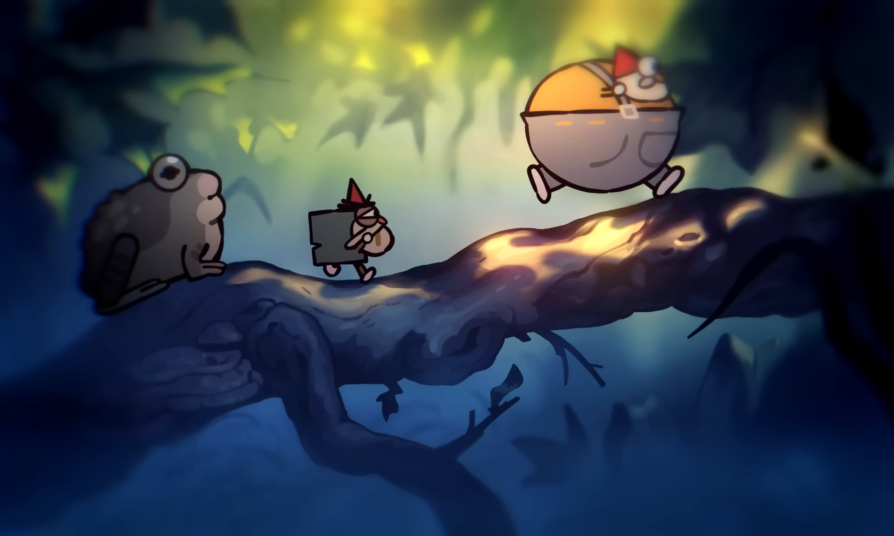
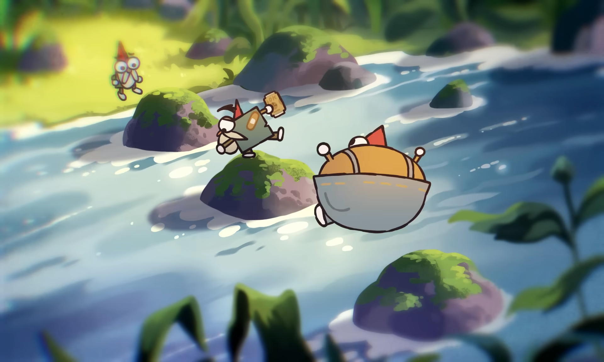
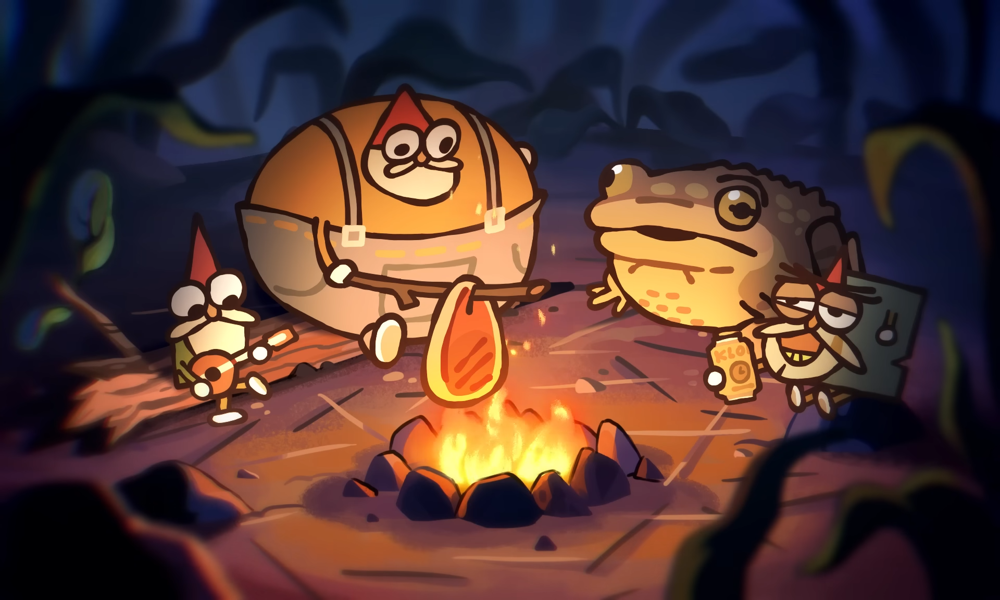

  <!-- Главный баннер-приветствие -->
  

  # 🌿 Welcome to the Moss Patch!

  *Minimalist Coder & Maker of Small Things.*

---

### 🛠️ About Me

* 🛠️ **Building:** Small tools, clean logic, and elegant code.
* 💚 **Likes:** Moss, pixels, mushrooms, and simple workflows.
* 🍄 **Status:** Wandering through the digital forest.

---

  <!-- Картинка: Путь по бревну -->
  

### 🧰 Tech Stack

---

  <!-- Картинка: Переправа через реку -->
  

### 📊 Stats

  

---

  <!-- Картинка: Привал у костра -->
  

  ### 📫 Take a Rest at the Campfire

  *Gnomes only use email (and maybe discord)*  
  Feel free to open an Issue or a Pull Request!

